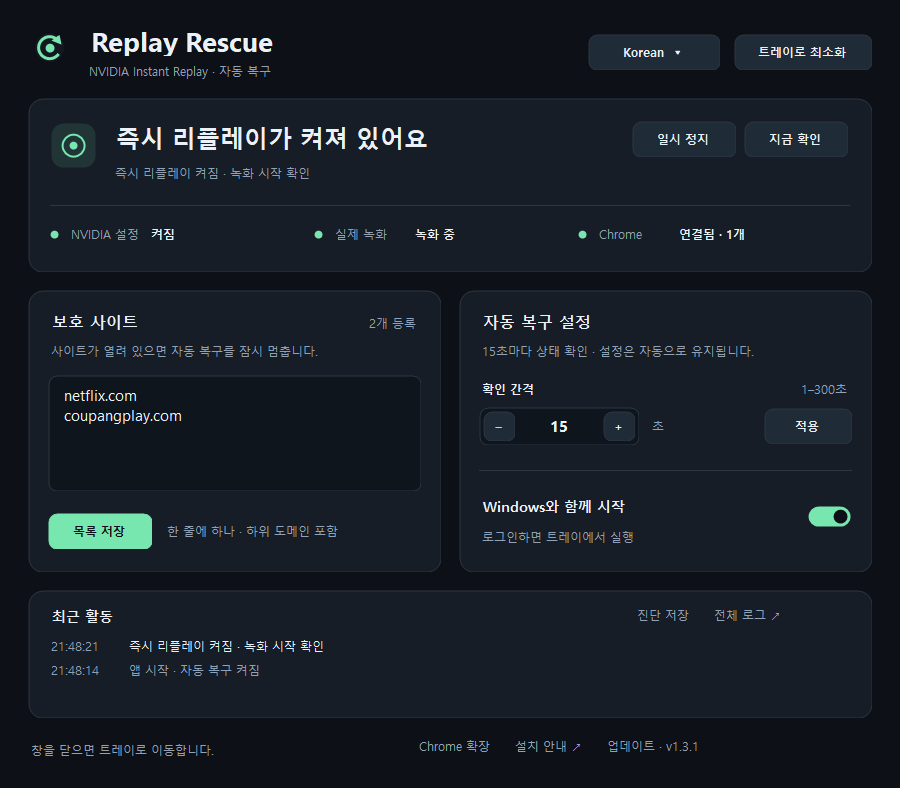
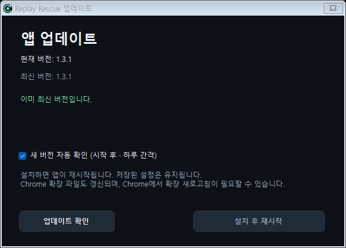

# Replay Rescue

[English](README.md) · [최신 ZIP 다운로드](https://github.com/sjh7711/ReplayRescue/releases/latest/download/ReplayRescue-win-x64.zip)

Windows용 NVIDIA 즉시 리플레이 자동 복구 앱. .NET Framework 4.8 / Windows 10·11 x64. 별도 .NET SDK나 Python 설치 없이 `ReplayRescue.exe`로 실행합니다.



꺼진 즉시 리플레이를 설정한 간격으로 확인해 다시 켜고, 트레이에서 활성 상태를 표시합니다. Chrome 확장을 연결하면 보호 사이트가 열려 있는 동안 자동 복구를 멈춥니다. NVIDIA 공식 제품이 아닌 개인용 도구입니다.

## 빠른 시작

1. [최신 Windows용 ZIP 다운로드](https://github.com/sjh7711/ReplayRescue/releases/latest/download/ReplayRescue-win-x64.zip) 후 쓰기 가능한 폴더에 압축을 풉니다. 버전별 파일과 변경 사항은 [Releases](https://github.com/sjh7711/ReplayRescue/releases)에서 확인하세요.
2. 포함된 `ReplayRescue.exe`를 실행합니다. `extension` 폴더와 `extension-id.txt`를 EXE와 함께 보관하세요.
3. **선택: 보호 사이트 확인을 사용할 경우** Chrome에서 `chrome://extensions`를 열고 **개발자 모드 → 압축해제된 확장 프로그램을 로드합니다**를 선택합니다.
4. 압축을 푼 폴더 안의 `extension` 폴더를 선택합니다.
5. 앱에서 확인 간격과 Windows 자동 실행을 설정합니다. 확장을 설치했다면 Chrome 연결과 보호 사이트 목록도 확인합니다. 확장 없이 사용할 때는 3~4단계를 생략하세요.

창을 닫으면 트레이에서 계속 실행됩니다. 트레이 아이콘을 두 번 클릭하면 창이 열리며, 우클릭 메뉴에서 완전히 종료할 수 있습니다. 전체 설치 안내는 [시작하기.html](시작하기.html)을 다운로드한 폴더에서 여세요.

## English / Korean 전환

상단 **트레이로 최소화** 옆 언어 메뉴에서 **English** 또는 **Korean**을 선택하세요. 화면, 상태 설명, 트레이 메뉴, 툴팁, 최근 활동이 즉시 바뀌며 다음 실행에도 유지됩니다. 편집 중인 도메인과 확인 간격은 그대로 유지합니다. 처음 실행할 때는 Windows 표시 언어가 한국어이면 한국어, 그 외에는 영어가 기본입니다.

Chrome 확장의 팝업과 상태 설명도 연결된 앱의 언어를 따릅니다. 업데이트 후 기존 확장을 사용 중이면 `chrome://extensions`에서 **새로고침**을 한 번 누르세요. 확장 연결 전에는 Chrome 표시 언어를 사용합니다.

## 앱 내 업데이트

v1.3.1부터 앱 하단 **업데이트** 또는 트레이 메뉴의 **앱 업데이트**에서 새 버전을 확인하고 **설치 후 재시작**할 수 있습니다. 자동 확인은 기본으로 켜져 있습니다. 확인할 때가 되면 시작 약 30초 후 조회하고, 실행 중에는 24시간 이상 간격으로 조회합니다. 자동 확인을 꺼도 수동 확인은 가능합니다. 자동 확인만으로 설치하거나 앱을 재시작하지는 않습니다.

설치 시 GitHub의 정식 릴리스 ZIP을 내려받아 SHA256과 EXE 버전을 검증하고, 기존 파일을 백업한 뒤 교체합니다. 저장된 도메인·언어·간격·일시 정지·자동 실행 설정과 `data` 폴더는 유지됩니다. 편집 중인 내용은 먼저 저장하세요. 교체 실패 시 이전 파일로 복구하며, 백업은 `data/updates/`에 보관합니다. 원래 창 또는 트레이 상태로 다시 실행됩니다.



업데이트 확인·다운로드는 GitHub에 HTTPS로 연결합니다. 계정이나 토큰은 필요하지 않으며 설정·도메인·활동 로그를 업로드하지 않습니다. 네트워크 오류나 검증 실패 시 실행 중인 앱은 유지됩니다. Chrome 확장 파일도 갱신하므로 필요하면 `chrome://extensions`에서 확장을 새로고침하세요.

**v1.3.0 이하에서 처음 올릴 때:** 구버전에는 업데이트 기능이 없으므로 한 번은 앱을 종료하고 새 ZIP을 풀어야 합니다. 기존 `data` 폴더를 보존하세요. Chrome이 EXE를 사용 중이면 확장을 껐다가 파일 교체 후 다시 켜세요.

### Chrome 확장이 꼭 필요한가요?

**아니요. 확장 없이도 자동 복구가 동작합니다.** 확장을 설치하지 않았거나 비활성화해 연결이 없으면 웹 체크를 생략하고, 사용자가 지정한 간격으로 NVIDIA 상태를 확인해 즉시 리플레이를 다시 켭니다. 앱에는 **웹 체크 생략**으로 표시됩니다. 이 모드에서는 보호 사이트가 열려 있어도 복구를 시도합니다.

확장이 연결되면 보호 사이트 확인이 자동으로 다시 적용됩니다. Netflix 같은 등록 사이트가 열려 있으면 복구를 보류합니다. 앱의 **일시 정지**는 확장 연결 여부와 관계없이 자동 복구를 멈춥니다.

## 사용

`시작하기.html` 참조. 처음 EXE 실행 시 현재 사용자용 Chrome Native Messaging 호스트와 로그인 자동 실행(`--tray`)을 등록합니다. 보호 사이트 확인을 사용하려면 Chrome에서 `extension`을 압축 해제 확장으로 한 번 로드합니다. 그 후 도메인 추가/삭제는 데스크톱 앱에서 합니다.

- 기본 도메인: `netflix.com`, `coupangplay.com` 및 그 하위 도메인.
- 모든 열린 탭의 URL과 pendingUrl을 **확장 내부에서만** 비교합니다. 백그라운드 탭, discarded 탭도 검사합니다.
- 네이티브 호스트에 보내는 정보: 일치하는 등록 도메인, 정책 버전, 창 수, 시크릿 접근 가능 여부. 전체 URL·페이지 내용은 전송하지 않습니다.
- 프로필마다 확장을 설치하세요. 확장이 없는 프로필과 허용하지 않은 시크릿 탭의 존재/URL은 알 수 없습니다.
- 확장 연결이 없거나 최신 보고가 45초 넘게 중단되면 웹 체크를 생략하고 자동 복구를 계속합니다. 현재 연결된 확장이 첫 탭 보고나 변경한 도메인 정책을 동기화하는 동안에는 보고를 기다립니다. 다시 연결되어 보호 사이트가 확인되면 복구를 멈춥니다.
- 앱의 **자동 복구 설정 → 확인 간격 → 적용**으로 NVIDIA 상태 확인 주기를 **1~300초** 사이에서 지정합니다. 숫자를 직접 입력하거나 − / + 버튼으로 조절합니다. 기본값은 2초이며 저장 즉시 타이머에 적용되고 재실행 후에도 유지됩니다. Chrome 탭 변경 알림과 연결 확인은 별도로 계속 동작합니다.
- 상단 카드에서 NVIDIA 설정, 실제 녹화, Chrome 연결을 각각 확인합니다. **보호 사이트 → 목록 저장**으로 도메인을 수정하며, **Windows와 함께 시작** 스위치로 자동 실행을 설정합니다. **최근 활동**은 마지막 3개 기록을 표시하고 **전체 로그**에서 모든 기록을 열 수 있습니다.
- Chrome 툴바 아이콘에는 원 두 개가 표시됩니다. **왼쪽 = NVIDIA 즉시 리플레이 활성 여부**, **오른쪽 = 데스크톱 감시 앱 연결 여부**입니다. 초록은 활성/연결, 빨강은 비활성 또는 확인 불가/연결 안 됨입니다. 마우스를 올리거나 팝업을 열면 텍스트로 상태를 확인할 수 있습니다.
- 아이콘의 NVIDIA 상태는 사용자가 설정한 확인 간격에 따라 수집되며, 확장까지 전달되는 데 최대 약 5초가 추가됩니다. 연결을 잃으면 오래된 활성 상태를 초록색으로 유지하지 않습니다. 왼쪽은 켜짐 설정이며 실제 녹화 시작 확인은 앱에 별도로 표시합니다.
- 마지막 보호 탭 종료 후 5초 유예, 꺼짐 재확인 3초. 실제 복구 시점은 설정한 확인 간격에 따라 달라집니다. 전환 직전에 NVIDIA와 도메인을 다시 읽습니다.
- 단축키는 사용자 NVIDIA 설정에서 읽습니다. 임의의 기본 단축키로 대체하지 않습니다.
- 이미 켜짐/알 수 없는 상태에서는 토글하지 않습니다. 실패 후 30·60·120·240·300초 간격으로 재시도합니다.
- NVIDIA의 보호 콘텐츠 알림 직후에는 대기합니다. 드라이버나 NVIDIA 파일을 수정하지 않습니다.
- 로그아웃/로그인 시 자동 실행, 트레이 숨김, 사용자 일시 정지 지원. 자동 실행은 UI에서 해제할 수 있습니다.
- Windows 트레이 아이콘은 **즉시 리플레이 켜짐 = 초록**, **꺼짐 = 노랑**, **확인 중/확인 불가 = 회색**입니다. 자동 복구 일시 정지 여부와 별도로 NVIDIA 활성 상태를 표시하며, 설정한 확인 간격마다 갱신합니다. 마우스를 올리면 활성 상태와 감시 상태를 함께 볼 수 있습니다.

## 빌드와 검증

```powershell
.\build.ps1
.\ReplayRescue.exe --self-test
node .\tests\extension.test.cjs
node .\tests\extension-language.test.cjs
node .\tests\native-host.test.cjs
.\tests\update-install.ps1
```

실행 파일은 Windows에 포함된 .NET Framework C# 컴파일러로 빌드합니다. Node는 확장 개발 테스트와 최초 공개키 생성에만 사용합니다. 실행 시 필요하지 않습니다.

`--check-update`는 설치 없이 GitHub 버전을 확인해 `data/update-available.json`에 저장합니다. `tests/update-install.ps1`은 별도 시험 폴더와 가짜 앱으로 종료·교체·재시작·파일 잠금 시 복구를 검증하며 NVIDIA 설정이나 Windows 등록을 변경하지 않습니다.

빌드하기 전에 트레이 메뉴에서 실행 중인 Replay Rescue를 종료하세요. `native-host.json`과 `data/`는 각 PC에서 실행할 때 생성되며 저장소에는 포함하지 않습니다. `install.ps1`은 EXE를 처음 실행하는 대신 연결과 자동 실행을 등록할 때 사용할 수 있습니다.

`--diagnose`는 `data/diagnostic.json`에 읽기 전용 진단을 저장합니다. `--recover-once`는 명시적인 수동 진단용으로, 브라우저 제한 없이 알려진 NVIDIA 꺼짐 상태에 한 번 토글을 보냅니다. **자동 감시는 이 경로를 사용하지 않습니다.** `--native-host`는 네이티브 메시지 프로토콜 테스트용입니다. `--preview`는 입력을 보내지 않는 UI 렌더링입니다.

`--ui-test`는 숨김/복원/최소화/닫기를 검사합니다. `--integration-test`는 실제 Chrome 연결이 있고, 보호 도메인이 없고, 녹화 중이 아닌 게임 전용 대기 상태일 때에만 한 번 끈 뒤 별도로 실행 중인 감시 앱의 자동 재활성화를 확인합니다. 일반 사용에는 필요하지 않습니다. 이 PC의 검증 결과는 `VALIDATION.md`를 참고하세요.

## 구성

- `src/Models.cs`: 설정, 브라우저 보고 검증, 복구 상태 기계.
- `src/Native.cs`: 읽기 전용 NVIDIA 레지스트리 상태·단축키, 공유 모드 로그 읽기, Windows 키 입력.
- `src/NativeHost.cs`: 크기 제한된 Native Messaging 프레이밍과 브라우저 보고. Chrome이 직접 실행하며 stdout은 프로토콜만 사용합니다.
- `src/MainForm.cs`: 한국어/영어 WinForms UI, 트레이, 자동 실행 옵션.
- `src/Localizer.cs`: 화면·상태·오류 번역 및 언어 선택 처리.
- `src/UiControls.cs`: 둥근 카드·버튼, 자동 실행 스위치, 간격 입력, 상태 표시와 최근 활동.
- `src/Integration.cs`: 현재 사용자 레지스트리 통합. 관리자 권한 불필요.
- `extension/`: Manifest V3 확장. 권한은 tabs, nativeMessaging, alarms뿐입니다. 원격 호스트 권한/콘텐츠 스크립트/포트 리스너가 없습니다.
- `data/`: 설정·상태·회전 로그·진단. 다른 PC에 배포할 때 이 폴더는 제외합니다.

## 검증 범위와 제한

NVIDIA App 11.0.9.251의 실제 설치에서 읽기 및 전환 입력을 확인했습니다. NVIDIA의 활성화 설정과 최신 `IR Enabled` 이벤트로 다시 켜짐을 검증합니다. 실제 녹화 여부는 `IR Started` / `GetInstantReplayRunningStatus` 기록을 별도로 표시합니다. 데스크톱 캡처가 꺼져 있으면 게임 실행을 기다리는 상태를 정상 대기로 표시합니다.

로그는 NVIDIA 내부 구현이며 공개 API가 아닙니다. 녹화 시작 기록은 프레임/오디오의 계속된 정상성을 보장하지 않습니다. 실제 클립 저장 검증은 게임에서 해야 합니다. 이 앱은 NVIDIA 설정이 켜졌는데 캡처 파이프라인 자체가 멈추는 모든 드라이버 오류를 수리하지 않습니다.

Chrome 확장 로드와 실제 Netflix/Coupang Play 탭 종료를 포함한 최종 시험은 해당 브라우저에서 필요합니다. 권한이 다른 프로필/시크릿 창 또는 다른 브라우저의 탭은 해당 Chrome 확장으로 볼 수 없습니다.

참고: [Chrome Native Messaging](https://developer.chrome.com/docs/extensions/develop/concepts/native-messaging), [Tabs API](https://developer.chrome.com/docs/extensions/reference/api/tabs), [NVIDIA 보호 콘텐츠 안내](https://nvidia.custhelp.com/app/answers/detail/a_id/5602/). NVIDIA 레지스트리 상태 식별자는 [AlwaysShadow의 설명/구현](https://github.com/Verpous/AlwaysShadow)에서도 확인할 수 있습니다. 이 프로젝트의 구현은 새로 작성했습니다.
