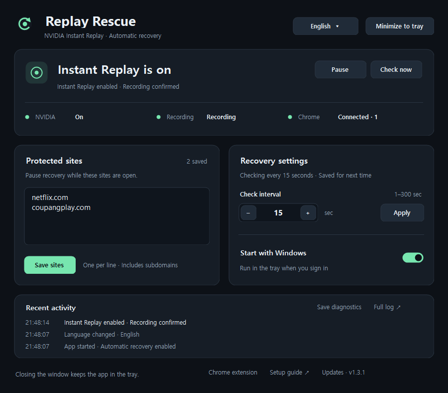
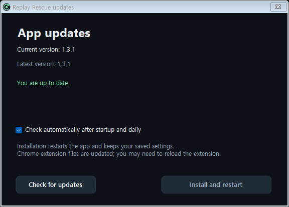

# Replay Rescue — NVIDIA Instant Replay Auto Recovery

**[Download for Windows x64](https://github.com/sjh7711/ReplayRescue/releases/latest/download/ReplayRescue-win-x64.zip)** · [Releases](https://github.com/sjh7711/ReplayRescue/releases) · [Korean](README.ko.md)

Replay Rescue is a Windows tray app that automatically re-enables **NVIDIA Instant Replay / ShadowPlay** when it turns off. Choose a check interval, see the current state in your system tray, and optionally pause recovery while streaming sites are open in Chrome.



**Instant Replay keeps turning off after watching Netflix?** NVIDIA may disable capture when protected content is detected. Replay Rescue monitors the enabled state and sends your configured NVIDIA toggle shortcut when recovery is appropriate. It does not patch NVIDIA files or drivers.

## Features

- **Automatic recovery:** check every 1–300 seconds; avoid toggling replay that is already enabled.
- **Optional Chrome protection:** pause recovery for Netflix, Coupang Play, or your own domains. Resume after protected tabs close.
- **Works without the extension:** skip website checks and continue recovery when no extension is connected.
- **Tray status:** green = replay enabled, yellow = disabled, gray = unknown.
- **English / Korean:** switch instantly next to **Minimize to tray**. The choice is saved, and the extension follows it when connected.
- **Windows startup:** start quietly in the tray, with a manual pause/resume control.
- **In-app updates:** automatically check GitHub for stable releases, then download, verify, install, and restart from the app.
- **Separate capture status:** display the enabled setting and confirmed recording state independently.

## Download and run

1. Download **[ReplayRescue-win-x64.zip](https://github.com/sjh7711/ReplayRescue/releases/latest/download/ReplayRescue-win-x64.zip)** and extract it into a writable folder.
2. Open `ReplayRescue/ReplayRescue.exe`. Keep `extension-id.txt`, the `extension` folder, and the setup guides alongside the EXE.
3. Choose **English** or **Korean** from the menu next to **Minimize to tray**. Korean Windows defaults to Korean; other Windows display languages default to English.
4. Set your check interval and startup preference. No .NET SDK, Node.js, or Python installation is needed to run the app.

Requirements: Windows 10/11 x64, .NET Framework 4.8, an NVIDIA GPU, and NVIDIA App with its overlay and Instant Replay toggle shortcut available. Replay Rescue is an independent utility, not an official NVIDIA product.

The first run registers the local Chrome Native Messaging host and enables login startup. Both use the current Windows user; administrator privileges are not required. Closing or minimizing the window hides it to the tray. Double-click the tray icon to reopen it; right-click → **Exit Replay Rescue** to quit.

For the offline setup guide, open [GettingStarted.html](GettingStarted.html) from the extracted folder. [Korean setup guide](시작하기.html) is also included.

## Optional Chrome extension

1. Open `chrome://extensions` and enable **Developer mode**.
2. Choose **Load unpacked**, then select the included `extension` folder.
3. In Replay Rescue, confirm that Chrome is connected.
4. Add one domain per line under **Protected sites**, then select **Save sites**. Subdomains are included.

The defaults are `netflix.com` and `coupangplay.com`. All tabs visible to the extension are checked, including inactive tabs. Install the extension in each Chrome profile you use. Incognito windows require **Allow in incognito** in the extension's details.

**Without a connected extension, website checks are skipped.** Recovery continues at your chosen interval, even if a protected site is open. Reports older than 45 seconds are treated as disconnected. A connected extension's initial report or updated domain policy is awaited before recovering. The **Pause** button stops recovery in either mode.

The extension icon has two lights: **left = Instant Replay enabled**, **right = desktop app connected**. Green means on/connected; red means off, unknown, or disconnected. Hover or open the popup for text details. Status delivery can take up to five seconds beyond the desktop check interval. Extension text follows the app's selected language; before connecting, it uses Chrome's display language.

## Updating

From v1.3.1, open **Updates** at the bottom of the app or **App updates** in the tray menu. Automatic checks are enabled by default: the first check runs about 30 seconds after startup if a check is due, then checks are spaced at least 24 hours apart while the app is running. You can disable automatic checks and still check manually.

When a newer stable release is available, choose **Install and restart**. The app downloads this repository's release ZIP, checks its SHA256 digest and executable version, backs up the existing files, and restarts in the same window/tray mode. Save pending edits before installing. Saved settings, domains, language, interval, startup preference, and the `data` folder are preserved. File replacement failures restore the previous files; backups remain under `data/updates/`.



Updates contact GitHub over HTTPS; no account or token is needed. Checks alone never install or restart the app. Unavailable releases, failed network requests, and invalid packages leave the running app in place. The unpacked Chrome extension's files are also updated; reload the extension at `chrome://extensions` if its running code needs refreshing.

**Upgrading from v1.3.0 or earlier:** those versions do not have an updater. Exit Replay Rescue from its tray menu and extract the new ZIP once. Keep your existing `data` folder. If Chrome temporarily keeps the EXE open, disable the extension during replacement and enable it afterward.

Using the same folder preserves the registered paths. If you move the app, run the EXE at its new location, switch Windows startup off and on, and load the extension from its new folder.

## How recovery works

Replay Rescue reads the current user's NVIDIA enabled setting and overlay logs. It waits briefly after protected tabs close, confirms a known-off state, and checks conditions again immediately before sending the configured toggle shortcut. It does not guess a shortcut or toggle an enabled/unknown state. Failed attempts use increasing retry intervals.

If desktop capture is off, **Waiting for game capture** can be normal. An enabled setting is not proof that video and audio are being recorded correctly. NVIDIA's internal registry/log formats may change with updates. Validation to date used NVIDIA App 11.0.9.251; clip playback should be checked in your own game. See [validation notes](VALIDATION.md).

## Privacy and local files

- Matching happens inside the Chrome extension. It sends only matching configured domains, policy version, window count, incognito permission, and extension version to the local app.
- Full browsing URLs, page content, cookies, and browsing history are not sent to the desktop app.
- Replay recovery needs no remote service, account, or local HTTP server. Optional update checks and downloads use GitHub; they do not upload settings, domains, or activity logs. Settings, status, and logs stay in `data/`.
- `data/`, generated `native-host.json`, diagnostics, and temporary binaries are excluded from Git and release packages.

## Build and verify

Exit the running app before building. Windows' bundled .NET Framework C# compiler is used:

```powershell
.\build.ps1
.\ReplayRescue.exe --self-test
.\ReplayRescue.exe --ui-test
node .\tests\extension.test.cjs
node .\tests\extension-language.test.cjs
node .\tests\native-host.test.cjs
.\tests\update-install.ps1
```

Node.js is only needed for extension development checks. `--diagnose` writes a read-only diagnostic snapshot. `--check-update` checks GitHub without installing and writes `data/update-available.json`. `--preview --language=en` and `--preview --language=ko` render the app without saving preferences or sending recovery shortcuts; add `--preview-update` to render an offline update-dialog preview. Diagnostic logs retain stable messages so a language switch does not affect recovery policy. `tests/update-install.ps1` uses isolated fixture apps to check process handoff, restart, file-lock rollback, and preservation of preferences without touching NVIDIA or registering the fixture with Windows.

`--recover-once` and `--integration-test` are explicit developer diagnostics that can send a replay toggle. Normal use does not require them. The integration check only operates with a connected clear browser and known idle, game-only capture.

Source: `src/MainForm.cs` and `src/UiControls.cs` for the UI; `src/Localizer.cs` for desktop translations; `src/Models.cs` for recovery rules; `src/Native.cs` for NVIDIA state and Windows input; `src/NativeHost.cs` for the extension bridge; `extension/` for the Chrome extension.

## Uninstall

Turn off **Start with Windows**, exit from the tray menu, and remove the Chrome extension. `uninstall.ps1` removes this folder's startup and native-host registrations while leaving files and logs intact.

References: [Chrome Native Messaging](https://developer.chrome.com/docs/extensions/develop/concepts/native-messaging), [NVIDIA protected-content behavior](https://nvidia.custhelp.com/app/answers/detail/a_id/5602/), and [AlwaysShadow](https://github.com/Verpous/AlwaysShadow) for background on the NVIDIA state identifier. Replay Rescue's implementation was written independently.
